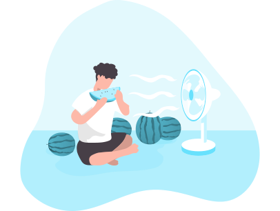

<link rel="apple-touch-icon" sizes="180x180" href="/apple-touch-icon.png">
<link rel="icon" type="image/png" sizes="32x32" href="/favicon-32x32.png">
<link rel="icon" type="image/png" sizes="16x16" href="/favicon-16x16.png">
<link rel="manifest" href="/site.webmanifest">
<link
rel="stylesheet"
href="https://cdnjs.cloudflare.com/ajax/libs/animate.css/4.1.1/animate.min.css"
/>

	
	
<h3>Matthew Grady ☕ </h3> 

In my free time, I like to enjoy time with my Wife, friends. Or watching Twitch/YouTube, gaming and a wide array of outdoorsy stuff.

Get connected at <a href="https://linkedin.com/in/matthew-grady-7b752a16">LinkedIn</a>
	

	
	
<h3>Stuff & Things (But not limited to)</h3> 
<ul>
  <li>Agile</li>
  <li>Node</li>
  <li>Python</li>
  <li>Angular</li>
  <li>GIS</li>
  <li>Adobe Creative Cloud, Microsoft Suite</li>
  <li>Coffee</li>
  <li>MongoDB, Postgres, MySql, MsSql</li>
  <li>Cloud</li>
</ul>  
	

	
	
<h3>10XTS </h3> 
I'm currently working with a FinTech company out of Ohio. We are work to provide regulatory frameworks for operating on distributed/decentralized ledgers. Contact us at 10XTS to more about launching, managing and securing traditional asset classes on new and exciting databases. 
	

	
	
<h3>Curiosity Chart</h3> 
This is an aggregate count of views of this repository supplied by GitHub API. 
<section id="curiosity-container" class="curiosity-container"></section>
	

	
	
<h3>Special Thanks</h3> 
		My Wife, <a href="https://www.manypixels.co/gallery">ManyPixels Vectors</a>, friends, family, co-workers and mentors who have helped me and continue to help me to become a better engineer.
	

